#  Tenniarb - General information

Tenniarb is a diagram/modelling tool, capable of doing simple and complex diagraming, easy organize them into categories. Easy create and style them, and as benetit it has a powerfull JavaScript calculation engine embedded, so styling and diagraming become a real powerfull solution for any kind of fast modelling and prototyping.

Every item on diagram is an object with set of properties, some properties have influence on how item is displayed on diagram. Some properties are user defined data, properties could depend on calculations and other items and properties.

In general every item on diagram could be treated as a cell in electronic table, but it allow not just one formula to be used but to define any set of formal and properties to be used.


## First steps

Tenniarb is multi window application, every window manage it own file on file system. Every file has plain text structure.

Simple diagram content will look like:

```
element "Simple" {
    item "Central" {
        font-size 30
        marker "🎁"
    }
}
```

Where `element` is describing a logic structure of diagram layers embedded one into another and `item` show individual items on diagram. Syntax is pretty easy to read and write by hands, it will be described in details in Syntax Section of this document. Language used to manage content of all element, items inside file are named Tenn. It was based on well known and old Tool Command Language(TCL) and have a clean and easy to use syntax.

### Main screen

Main window:

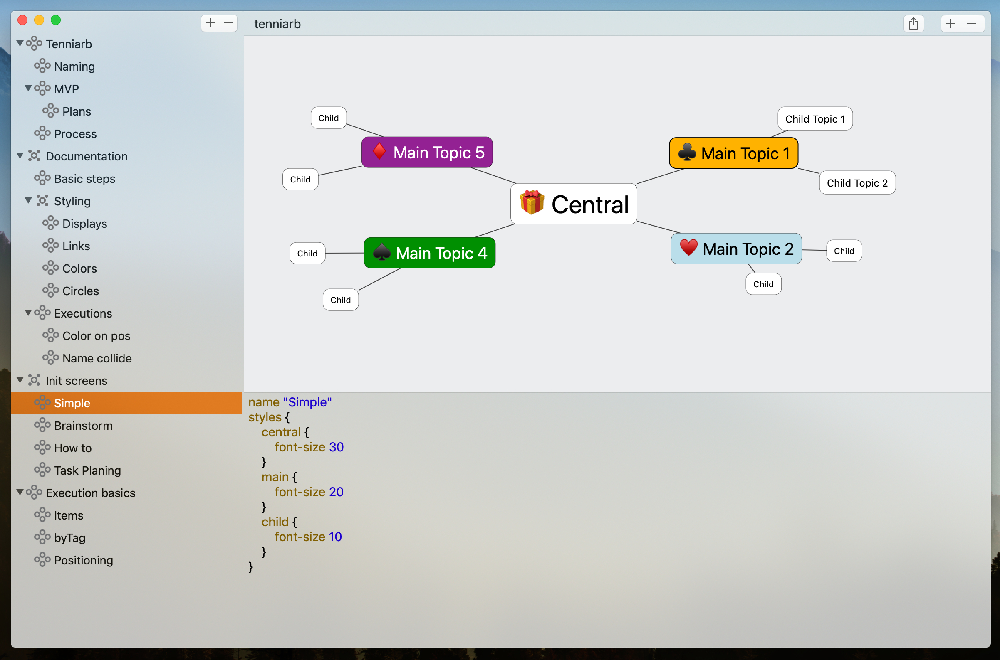

Main window has following structural components:

* Document logical structure:

    It allows to organise diagrams, and perform logical structure with basic operations of drag & drop, duplication and naming.

* Diagram with items.
    Support ordering items with links, styles for visual representation of ideas, structures and any kind of information required.

* Properties pane.

    A textual representation of selected diagram, item with properties managed by Tenn language.

### Creating and managing elements.

There is few ways to create elements.

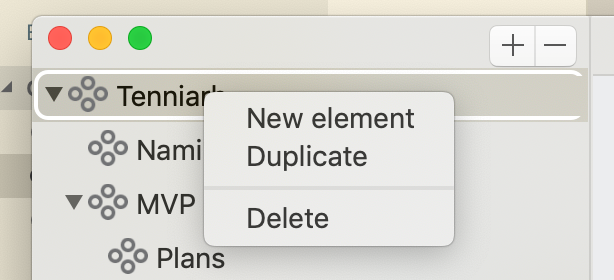

* Using (+), (-) buttons on top of logical structure, will add child item to selected top level item or delete child item. All this operations are support undo & redo.

* Drag & Drop - could be used to put items in right position and order.

* Duplicate - could be used for duplicate selected layer of diageam for perform some changes and see differences.


### Creating and managing items on diagram layer.

Item is a key point element of any diagram, it represent structure point of interest, it could contain any set of properties, properties could be groupped and represent a tree structured document. Main property of every item its his `name`. But name is not uniq representation so it could be multiple items with same name.

Item positioned on diagram using `pos x y` property.
On every selected layer items could be managed using items main panel.
After layer is selected we could use selection, modification and addition of new items.

Adding new items to diagram layer:
<table>
<tr>
<td>Pressing 'Tab' key on keyboard will add new item and link it with selected item. </td>
<td>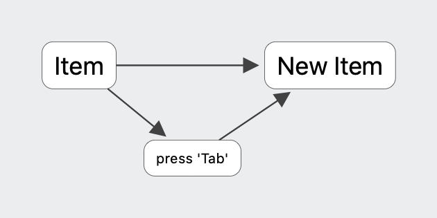</td>
</tr>
<tr>
<td>Pressing 'Option + Tab' key on keyboard will add new item, link it with selected item and copy styles from selected item.
</td>
<td>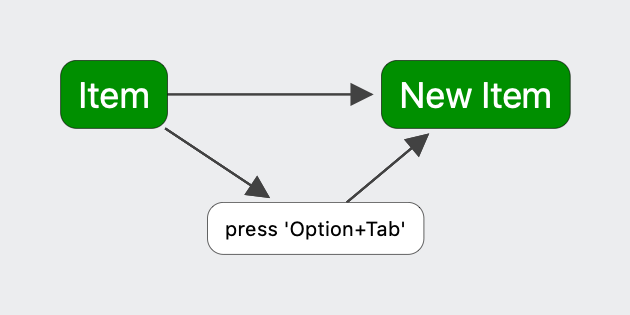</td>
</tr>
<tr>
<td>Pressing 'Command + D' key on keyboard will duplicate selected item and it incoming links, it could be used to easy create more linked items for brain maps.</td>
<td>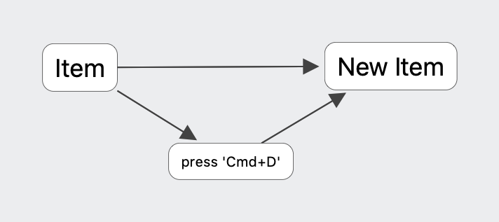</td>
</tr>
<tr>
<td>Clicking '(+)' button on top of items layer, will add item item and link it with selected item.</td><td></td>
</tr>

<tr>
<td>
Using context menu:
<ol>
<li> New item - Add new top level item.</li>
<li>New linked item - Add new linked item to selected one.</li>
<li>Linked styled item - Add new linked item with copy of styles to selected one.</li>
<li>Style - use or define new style.</li>
<li> Duplicate - dupliate selected item with incoming links.</li>
<li> Delete - delete current selected items.</li>
</ol>
</td>
<td>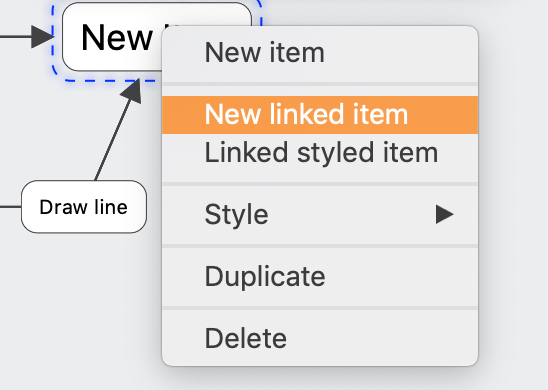</td>
</tr>
<tr>
<td>Styling items</td>
<td>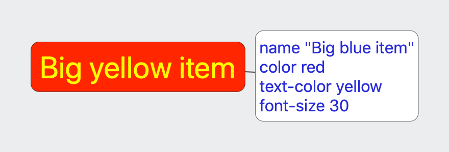</td>
</tr>
<tr>
<td>Popup toolbar could be used for fast apply for basic display, color,font size, line width and marker fields. </td>
</td>
<td>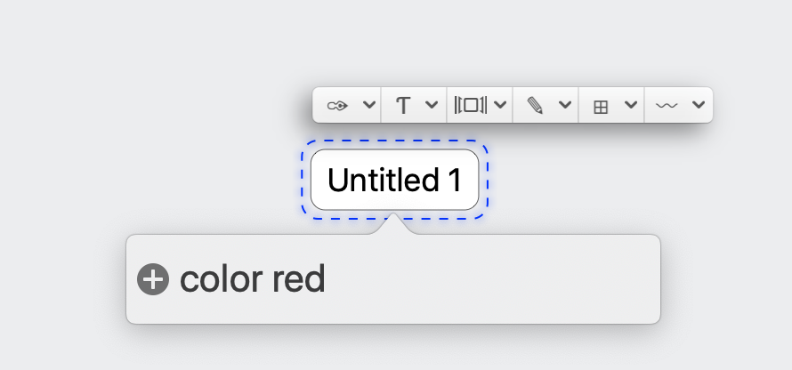</td>
<tr>
<td>All styles could be editing using textual representation in Tell language format. More details will be in Styling secrtion of this document.
</td>
<td>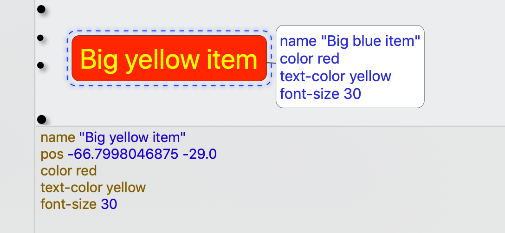</td>
</tr>
</table>


## Styling

Items on diagram could be styled via properties and via defined layer styles.
Tenniarb support following item styles to define different look:
### Colors

#### Item Background and color in general
Colors could be defined with following style property:
```
color red       // named color
color #ffeeff   // Full RGB color in hex.
text-color red // Define only text color.
```

Also it is included easy set of usefull colors based on this table

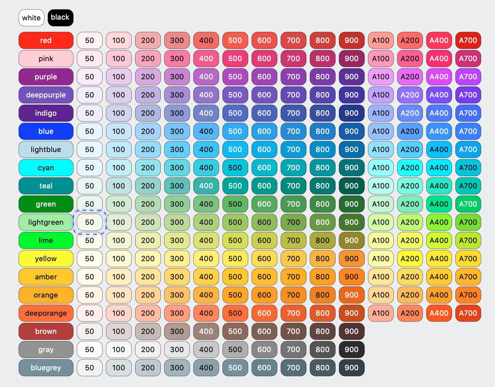

By passing `color name-variant` it is possible to easy define different color values. Ex: 'color red-500', 'color green-200'.

#### Text color

By default text color are selected to be in contrast with background for best viewing experience. So this would work well with Dark theme as well.

Text color could be configured using property `text-color`

```
text-color blue
```

<table>
    <thead>
        <th>Default mode:</th> <th>Dark mode:</th>
    </thead>
    <tr>
        <td>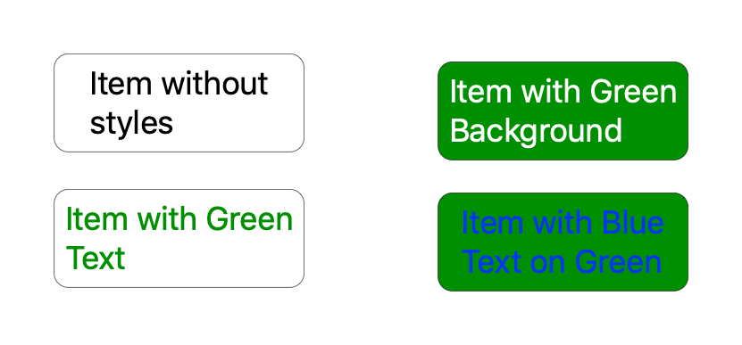</td>
        <td>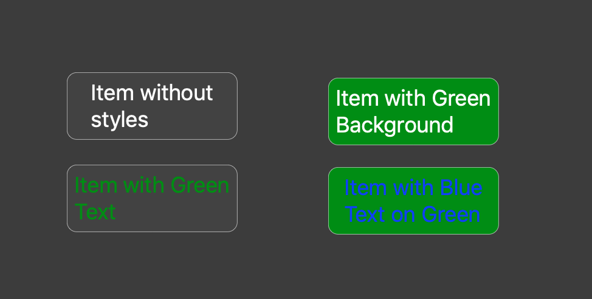</td>
    </tr>
</table>


Background and text color by default will be automaticcaly ajusted to fit into selected user theme.

#### Title and Body properties.

Every item on layer could be labeled by title and could have additional body field, if body is defined it will be shown udner title, and title will be on left of item.

By default `title` field uses name of item on layer. So it could be used without specificatio for most of situations. But could be changed, also `title` in compare to name support variable substituions and scripting.

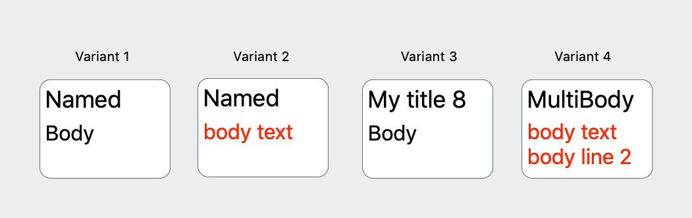


* Variant 1:
    Define via `body str` property Or `body %{}` for multi line variant.
* Variant 2:
    Define via body block with text property inside.
    ```
    body {
        text "body text"
        text-color red
    }
    ```
    Styling properties line `color`, `text-color`, `font-size`, etc are supported for individual title and body.
* Variant 3:
    Use `title "My title ${parent.items.length}"` to show number of all items on layer with JS code.
* Variant 4:
    Use multi line body
    ```
    body {
        text %{
            body text
            body line 2
        }
        text-color red
    }
    ```


#### Font size and body font size.

Item/Body font size could be configured via `font-size` property.

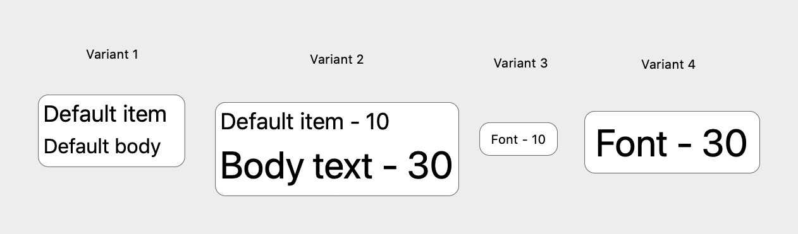


* Variant 1: Default title font are 18 and body font size is font-size - 2 points.
* Variant 2: Both title and body fonts are changed.
* Variant 3: Title font are changed.
* Variant 4: Title font are changed.

In all situations boundaries of item are calculated to fit both title and body.

#### Width/Height properties.

Bundaries of items could be changed by defining `width` and `height` properties.

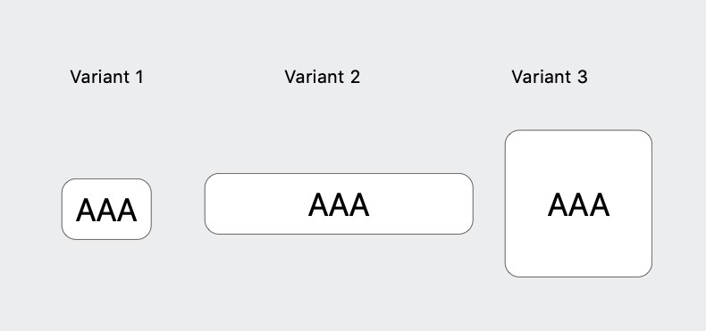

* Variant 1: `width 50` is defined.
* Variant 2: `width 150` is defined.
* Variant 3:
    ```
    name "AAA"
    width ${utils.textWidth(name)*2}
    height ${width}
    ```
    This variant uses utils object to calculate text size and multiple it two times, and set both width and height to same values. Be aware of using non static calculations on with/heigh since properties calculation could be cycled, only limited number of cyclec will be executed to have stable final results.

#### Display property.

Items on layer could have a different look.

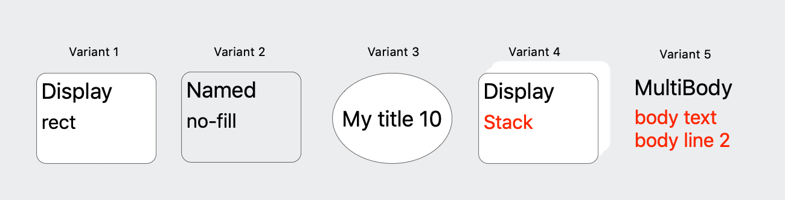


* Variant 1 - default or `display=rect`
    This variant is suitable for most of brain maps and other situations.
* Variant 2 - `display no-fill` a variable without background filling.
* Variant 3 - `display circle` a display of Eclipse/Circle. based on width and height of rect. It would be required to specify `width` and `height` properties to have a proper fit of text inside.
* Variant 4 - `display stack` a rect with stack line display.
* Variant 5 - `display text` a usefull for writing some text descriptions and formatted text areas. A full `markdown` syntax is planed for one of upcoming versions of product and could be specified via `body %{markdown}` or `title %{markdown}`

### Reusable styles
Every layer support it's own defined styles, this styles could be used to define look of items.

They are defined on layer item `styles`
```
styles {
    annotation {
        color gray-400
        font-size 12
        shadow 5 -5 5
    }
}
```

Every named group under styles are treaded as different style and could be applied to items. Using `use-style`
property. Also it is accessible via context menu:

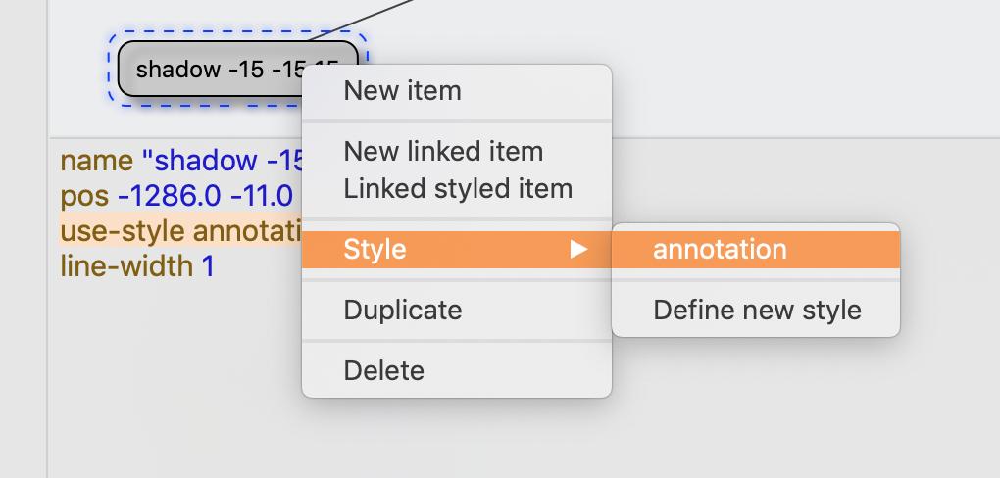


This context menu also allow to define more styles. On clicking to `Define new style` selection will switch to layer itself and add new item with counted name.

## Connections/Links

Every two items on diagram layer could be linked together by line reference. Source and target parts of line are always items, so links are drawn from source to target.

* How to add links:
  * By creation, using linked item.
  * By holding `ctrl` key and dragging from one item to another.

Links could also have some styles:

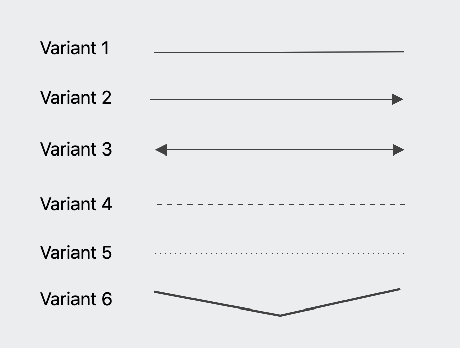

* Variant 1 - regular links, drawn by default.
* Variant 2 - `display arrow` draws arrow on target side.
* Variant 3 - `display arrows` draws arrows on both sides.
* Variant 4 - `line-style dashed` draw line dashed.
* Variant 5 - `line-style dotted` draw lines with dots.
* Variant 6 - `line-width 2` control width of line.

Every line could be split and corrected by dragging line, it will add a `pos x y` property to controll offset from line central point, so this point will be moved every time line source/target will be moven.

## Line styles.

Line styles also could be applied to items.


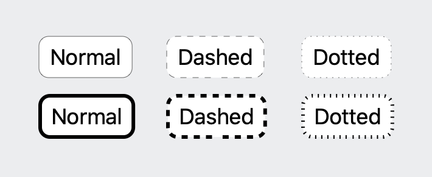

* `line-style dashed` draw line dashed.
* `line-style dotted` draw lines with dots.
* `line-width 2` control width of line.


# Tenniarb - Advanced details.

## Tenn language reference.

Language is based on well known and easy to use TCL (Tool command language) it has concept of command and arguments. Every command could have unlimited number of arguments, arguments could be identifiers, numbers, strings and block of commands. Argument in '{' '}' are treated as block of commands.

Simple example of tenn language file:
```
item "my item" {
    cmd1 1
    cmd2 1.1
}
```

So `item` is command with 2 arguments, String argument "my item" and block of commands arguments.

Every document in Tenniarb are tree of `element`'s represent outline structure of diagram layers. Every element could have child elements and `items` and `link` to represent items on diagram layer. So every touchable element of layer is `item`. `link`'s represent connections between different items.

Types of arguments:

* Identifier - a word without spaces containing characters/digits and set of special characters `-_.`. Command names are identifiers.
* String - a word between string start/end symbopls " or ' could be used. String support `${...}` JavaScript embeddings. String could be joined with `"abc" + "bce"` and be on different lines. Any `${expr}` inside string are interpreter via java script expressions.
String support `\c` escaping.
* Number - a decimal values `123` not containing . and other characters and symbols.
* Float - a decimal `.` decimal value.
* Comment - a sequence starting with // and ending of end of line.
* CComment - `/* ... */` - c style comments.
* Expressions - `${...}` `$(...)` - inner text of this expressions are interpreterd with JavaScript language.
* Markdown block - `%{...}` is interpreted as text block with multi line structure, could be highlighted and interpreterd as markdown markup.
* Command separator - `;` could be used as command separator within single line.

(!) All comments are fully removed at this versions of application during save and load.
